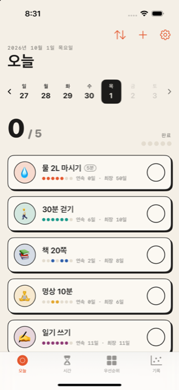
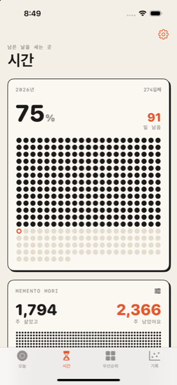
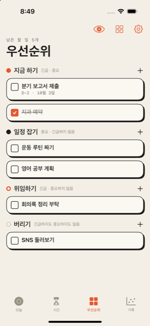
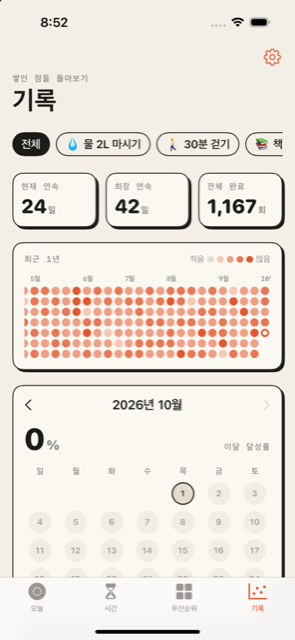
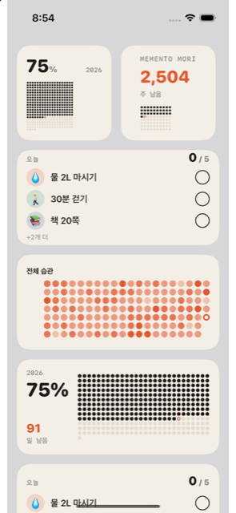
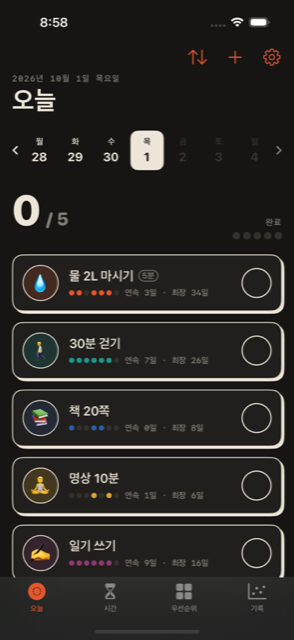

# Tally

습관 체크, 올해·인생 진행률, 아이젠하워 매트릭스를 한 앱에 담은 iOS 앱입니다.
**"종이 수첩과 잉크"** 콘셉트로 디자인했습니다.

| 오늘 | 시간 | 우선순위 | 기록 | 위젯 | 다크 |
|---|---|---|---|---|---|
|  |  |  |  |  |  |

## 기능
- **오늘 (습관)**: 이모지·색·목표 시간·매일 알림. 행을 탭하거나 오른쪽으로 밀어 체크. 연속/최장 기록, 주간 스트립으로 지난 날짜 수정, 순서 변경, 보관
- **시간**: 올해 진행률 점 그리드, 주 단위 라이프 캘린더(Memento Mori), D-Day, 배경화면 저장·공유, 단축어 `Tally 배경화면 만들기`
- **우선순위**: 아이젠하워 4분면, 드래그 앤 드롭 이동, 목록 보기, 완료 숨기기, 마감일
- **기록**: 최근 1년 잔디(전체/습관별), 현재·최장 연속, 전체 완료 수, 월별 달성률 달력
- **위젯**: 오늘의 습관(위젯에서 바로 체크), 올해 진행률(잠금화면 포함), 잔디(습관 선택), Memento Mori
- **설정**: 화면 모드, 테마 색 6가지, 주 시작 요일, 생년월일·기대 수명, 보관함, 데이터 초기화

## 요구 환경
- Xcode 16 이상 (폴더 동기화 그룹 사용, Xcode 27에서 검증)
- iOS 17.0 이상
- 외부 라이브러리 없음 (SwiftUI, SwiftData, WidgetKit, App Intents)

## 실행
```bash
open Tally.xcodeproj
```
스킴 `Tally`를 선택하고 시뮬레이터에서 실행합니다. 실제 기기에 설치하려면 각 타깃의 **Signing & Capabilities**에서 팀을 고르고, App Group `group.com.jinu2kk.tally`가 등록되어 있어야 합니다(번들 ID를 바꾸면 App Group 이름과 `Shared/Persistence.swift`의 `appGroupID`도 함께 바꿉니다).

## 테스트
```bash
xcodebuild -project Tally.xcodeproj -scheme Tally -destination 'platform=iOS Simulator,name=iPhone 15,OS=17.0' test
```
- `TallyTests`: 계산 로직, 모델, 인텐트 단위 테스트 (호스트 앱 없음)
- `TallyUITests`: 습관·우선순위·시간·설정 흐름 UI 테스트 (`-uiTesting YES`로 메모리 저장소 사용)

디버그 빌드 전용 실행 인자:

| 인자 | 동작 |
|---|---|
| `-seedDemo YES` | 기존 데이터를 지우고 예시 습관 5개, 할 일, D-Day를 채움 |
| `-seedDemo 50` | 습관 50개 × 1년치 (성능 점검용, 생성에 약 30초) |
| `-tab time` / `matrix` / `stats` | 해당 탭으로 시작 |
| `-widgetGallery YES` | 위젯 화면을 실제 크기로 미리 보기 |

## 구조
```
Tally/          앱: 화면(Views), 알림, 단축어, 시드
Shared/         앱·위젯·테스트 공용: 모델, 저장소, 설정, 테마, 계산, 점 그리드, 위젯 화면, 인텐트
TallyWidget/    위젯 확장: 번들, 타임라인 프로바이더
TallyTests/     단위 테스트
TallyUITests/   UI 테스트
Config/         entitlements, 위젯 Info.plist
scripts/        앱 아이콘 생성 스크립트
```

## 문서
설계와 진행 기록은 문서 4종에 있습니다.
- [REQUIREMENTS.md](REQUIREMENTS.md): 요구사항, 범위, 제외 항목
- [DESIGN.md](DESIGN.md): 결정 체크리스트, 아키텍처, 데이터 모델, 디자인 토큰
- [IMPLEMENT.md](IMPLEMENT.md): 단계별 작업, 테스트, 진행 상태
- [MANUAL_TEST_CHECKLIST.md](MANUAL_TEST_CHECKLIST.md): 수동 테스트 항목과 결과

## GitHub 인증 (이 Mac에서 push하기)
처음 한 번만 실행합니다.
```bash
brew install gh
gh auth login --hostname github.com --git-protocol https --web
gh auth setup-git
```
브라우저에서 표시된 코드를 입력해 승인하면 이후 `git push`가 바로 동작합니다. 토큰이나 비밀번호를 저장소에 커밋하지 마세요.

## 추후 작업
- iCloud 동기화 (모델은 CloudKit 호환으로 설계됨, 유료 개발자 계정 필요)
- 다국어 번역 (날짜 표기는 `Locale.app` 한 곳에서 바꿈)
- 위젯 체크·단축어·알림의 실기기 수동 검증 ([MANUAL_TEST_CHECKLIST.md](MANUAL_TEST_CHECKLIST.md) 참고)
